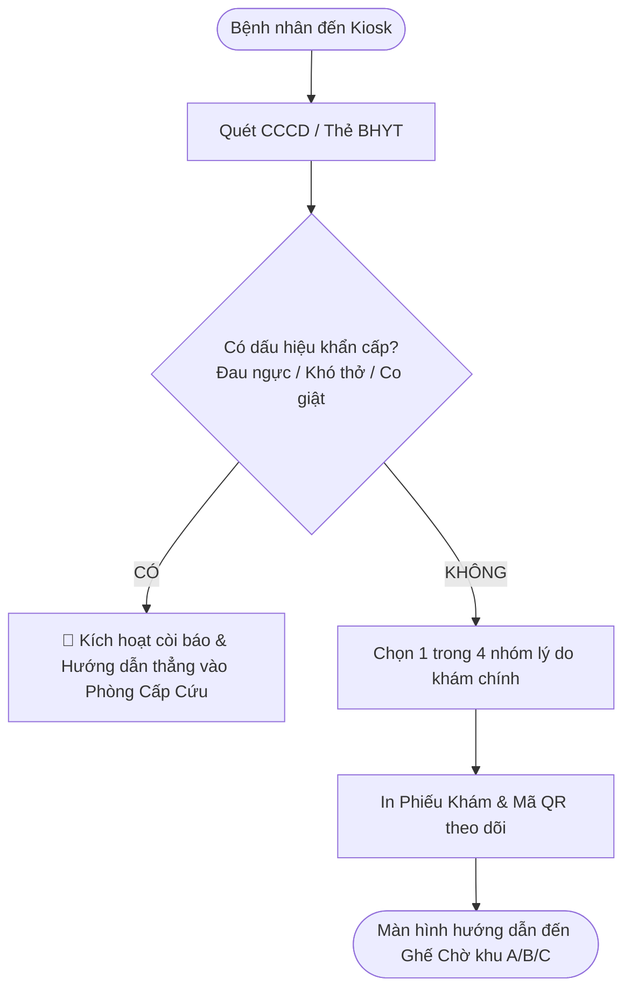

# UX Design & Interaction Flow Skill (`/ux-design`)

Thiết kế luồng thao tác người dùng (user flow / task flow), kiến trúc tương tác và hành trình trải nghiệm cho **mọi hệ thống** (phần mềm số, thiết bị phần cứng/IoT, quy trình dịch vụ con người, hoặc tác tử AI/hội thoại).

Mục tiêu cốt lõi: **Biến sự phức tạp thành trải nghiệm tự nhiên, dễ hiểu, loại bỏ triệt để điểm nghẽn thao tác và trao toàn quyền tự chủ cho người dùng.**

---

## 1. Nguyên tắc ngầm hiểu của AI (Internal Reasoning Only)

> [!IMPORTANT]
> Toàn bộ phần này là **kim chỉ nam tư duy ngầm hiểu** trong đầu của AI. **Tuyệt đối KHÔNG in ra biểu đồ ma trận, KHÔNG liệt kê thuật ngữ hàn lâm hay trích dẫn lý thuyết để "dạy đời" người dùng trong câu trả lời.**

Khi tiếp nhận yêu cầu, AI tự động phân tích ngầm 3 câu hỏi thực tế:
1. **Ai dùng?** Người mới vãng lai (cần hướng dẫn từng bước trực quan, tự giải thích) hay Chuyên gia thao tác hàng ngày (cần phím tắt, tốc độ cao, làm hàng loạt)?
2. **Hậu quả nếu bấm sai là gì?** Thấp (mua sắm, giải trí $\rightarrow$ ưu tiên mượt mà, cho phép Hoàn tác/Undo) hay Cao (y tế, tiền bạc $\rightarrow$ cần chốt chặn an toàn 2 lớp, chống mất dữ liệu)?
3. **Dùng ở đâu?** Web, ứng dụng điện thoại, máy kiosk màn hình chạm, thiết bị cơ học hay giọng nói?

Đồng thời, AI tự ngầm vận dụng các quy luật tâm lý nhận thức:
* Não người lười tư duy phức tạp: không bắt nhớ thông tin từ trang trước sang trang sau.
* Người dùng đọc lướt, hay vội vã: luôn thiết kế "vị tha" (có nút Undo, tự động lưu nháp liên tục, không bao giờ làm mất dữ liệu khi lỡ bấm nhầm).
* Tránh bẫy popup phiền hà ("Bạn có chắc không?"): thao tác thông thường thì cho chạy ngay kèm thanh Hoàn tác 5s.

---

## 2. Quy chuẩn phản hồi người dùng (Output Format)

Câu trả lời phải sử dụng ngôn ngữ tự nhiên, gần gũi, đi thẳng vào giải pháp thực tế theo đúng 2 chế độ sau:

### Chế độ 1: Thiết kế luồng mới (From-Scratch Design)
Khi người dùng nhờ tạo tính năng mới, quy trình mới hoặc xây dựng lại luồng trải nghiệm, trình bày đúng **3 phần tinh gọn**:

1. **Phần 1: Mục tiêu & Hành trình chính**
   * Nêu ngắn gọn mục tiêu cốt lõi của luồng.
   * Vẽ sơ đồ luồng trực quan bằng cú pháp Mermaid (`flowchart TD` hoặc `flowchart LR`).
2. **Phần 2: Chi tiết từng bước & Lối thoát an toàn**
   * Mô tả người dùng làm gì $\rightarrow$ Hệ thống phản hồi ra sao.
   * Chỉ rõ cách cứu khi bấm nhầm (nút Quay lại, Hoàn tác, Tự động lưu nháp, Xử lý lỗi tức thời).
3. **Phần 3: Lợi ích đo lường (Impact)**
   * Nêu các con số hoặc kết quả cụ thể: tiết kiệm bao nhiêu giây, giảm bao nhiêu thao tác thừa, tránh rủi ro mất dữ liệu ra sao.

---

### Chế độ 2: Kiểm toán & Cải tiến luồng có sẵn (Audit Mode)
Khi người dùng đưa ra một luồng đang chạy kèm yêu cầu review, audit, bắt lỗi hoặc cải thiện conversion:

* **Đi thẳng vào Bảng đối chiếu Trước (As-Is) vs Sau (To-Be)** (Không viết văn phân tích dài dòng bên trên để người đọc nắm bắt ngay giải pháp):

| Bước / Vấn đề | Luồng Hiện Tại (As-Is) | Luồng Cải Tiến Đề Xuất (To-Be) | Lợi Ích Đo Lường (Impact) |
| :--- | :--- | :--- | :--- |
| **[Tên bước]** | 🔴/🟡/🟢 Mô tả điểm bất cập, gây nghẽn hoặc ức chế | Mô tả giải pháp mới dễ thở, minh bạch, tôn trọng người dùng | Con số cụ thể (giảm thời gian, giảm tỷ lệ bỏ cuộc, giảm khiếu nại) |

* Quy ước nhãn mức độ trong bảng:
  * 🔴 **Nghiêm trọng:** Chặn đứng công việc, làm mất dữ liệu người dùng, hoặc dùng bẫy tâm lý ép buộc / lừa người dùng (Dark Patterns).
  * 🟡 **Cần sửa:** Gây khó hiểu, thao tác vòng vèo, dễ bấm nhầm.
  * 🟢 **Góp ý nhỏ:** Điểm trừ thẩm mỹ nhẹ hoặc câu chữ chưa thật mượt.

---

## 3. Ví dụ thực tế mẫu (Few-Shot Examples)

### Ví dụ 1: Thiết kế mới — Quy trình Tiếp đón & Phân loại Ngoại trú (Outpatient Triage)

#### 1. Mục tiêu & Hành trình chính
Giúp người bệnh đăng ký khám nhanh tại Kiosk bệnh viện dưới 2 phút, đồng thời phát hiện và cấp cứu ngay lập tức các trường hợp nguy kịch.

#### 2. Chi tiết từng bước & Lối thoát an toàn
* **Bước 1 — Nhận diện:** Người bệnh chỉ cần đặt CCCD hoặc quét mã QR trên điện thoại. Không bắt gõ bàn phím ảo.
  * *Lối thoát:* Nếu máy quét lỗi, có nút bấm "Nhập nhanh số điện thoại" hoặc nút đỏ vật lý "Gọi điều dưỡng hỗ trợ".
* **Bước 2 — Sàng lọc nguy kịch:** Màn hình hỏi 1 câu duy nhất với icon cảnh báo lớn. Nếu chạm "Có", hệ thống lập tức báo động nội bộ và chỉ đường vào phòng Cấp cứu ngay.
* **Bước 3 — Đăng ký khoa khám:** Chỉ hiện 4 nút lớn tương ứng 4 nhu cầu phổ biến nhất (Nội, Ngoại, Nhi, Tai Mũi Họng). Các chuyên khoa sâu sẽ do bác sĩ chỉ định sau.
* **Bước 4 — Nhận phiếu & Điều hướng:** Máy in phiếu có ghi rõ số thứ tự, số phòng, và thời gian dự kiến đợi.
  * *An toàn dữ liệu:* Thông tin tự động lưu nháp sang máy tính bảng của y tá bàn tiếp đón; người bệnh không bao giờ phải làm lại từ đầu nếu kiosk hết giấy in.

#### 3. Lợi ích đo lường (Impact)
* **Thời gian thực hiện:** Rút ngắn từ **8.5 phút xuống 1.5 phút** mỗi lượt tiếp nhận (giảm 82%).
* **Độ an toàn:** Loại trừ 100% tình trạng ca bệnh khó thở/nhồi máu cơ tim phải xếp hàng chờ đợi như thông thường.

---

### Ví dụ 2: Kiểm toán — Luồng Hủy Đăng ký Dịch vụ Định kỳ (SaaS Subscription Cancellation)

Dưới đây là bảng đối chiếu hiện trạng và phương án thiết kế lại luồng hủy gói:

| Bước / Vấn đề | Luồng Hiện Tại (As-Is) | Luồng Cải Tiến Đề Xuất (To-Be) | Lợi Ích Đo Lường (Impact) |
| :--- | :--- | :--- | :--- |
| **Quy trình hủy** | 🔴 **Nghiêm trọng (Bẫy giữ chân):** Bấm "Hủy" thì hiện 3 trang níu kéo, bắt điền khảo sát 8 câu bắt buộc, cuối cùng bắt gọi tổng đài mới cho hủy. | Tự phục vụ minh bạch 2 bước: Chọn lý do ngắn gọn (không ép buộc) $\rightarrow$ Bấm nút "Xác nhận hủy gói". | Thời gian thao tác giảm từ 15 phút (chờ gọi) xuống **dưới 30 giây**. |
| **Tùy chọn giữ chân** | 🟡 **Cần sửa:** Ép người dùng hoặc giảm giá chớp nhoáng với nút bấm đánh lừa màu sắc. | Đưa ra lựa chọn **"Tạm dừng gói 1–3 tháng"** hoặc chuyển sang gói miễn phí một cách văn minh. | Tăng **25–30%** lượng khách chọn tạm dừng thay vì hủy bỏ vĩnh viễn. |
| **Quyền lợi sau hủy** | 🔴 **Nghiêm trọng:** Cắt dịch vụ ngay lập tức khiến người dùng cảm thấy bị lừa tiền chu kỳ hiện tại. | Tiếp tục sử dụng đầy đủ tính năng cho đến hết ngày chu kỳ đã thanh toán; hiển thị rõ ngày hết hạn. | Giảm **85%** tranh chấp bồi hoàn thẻ ngân hàng (*chargeback*). |
| **Lối thoát & Phục hồi** | 🟡 **Cần sửa:** Không có cách nào khôi phục tài khoản nếu lỡ tay bấm hủy. | Gửi email xác nhận kèm nút "Khôi phục gói trong 30 ngày chỉ với 1 cú chạm". | Tăng **18%** tỷ lệ khách hàng cũ chủ động kích hoạt lại dịch vụ. |

---

## 4. Chiến lược nạp tài liệu tham khảo (Lazy-Loading)

Khi cần tra cứu sâu các kỹ thuật chuyên môn, AI sẽ chủ động mở các tài liệu bổ trợ trong thư mục `references/`:
* `references/ux-audit.md`: Bộ câu hỏi đánh giá sâu và thang điểm Heuristic chi tiết.
* `references/workflow-patterns.md`: Các mẫu dựng luồng phức tạp (Wizard tuần tự, Hub & Spoke, Inline Editing...).
* `references/cognitive-biases.md` (~61KB): Tài liệu giải phẫu tâm lý chuyên sâu, chỉ đọc khi người dùng yêu cầu phân tích học thuật cao cấp.
* `references/literature.md`: Nguồn trích dẫn các tài liệu kinh điển quốc tế.
