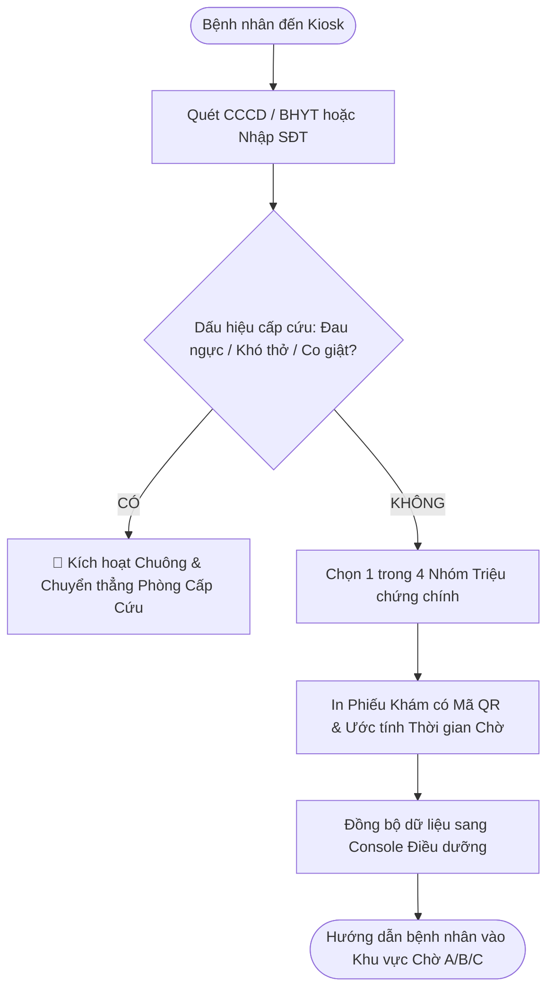

# UX Design & Interaction Flow Skill (`/ux-design`)

Thiết kế luồng tác vụ người dùng (user flow / task flow), kiến trúc tương tác và hành trình trải nghiệm cho **mọi hệ thống** (phần mềm số, thiết bị phần cứng/IoT, quy trình dịch vụ con người, hoặc tác tử AI/hội thoại).

Mục tiêu cốt lõi: **Biến sự phức tạp thành trải nghiệm tự nhiên, tôn trọng bản năng sinh học của con người, loại bỏ triệt để ma sát nhận thức (Cognitive Friction) và trao quyền tự chủ (User Autonomy).**

---

## 1. Adaptive Context Engine (Ma trận thích ứng ngữ cảnh tự động)

Không có một giải pháp UX nào phù hợp cho mọi bài toán. Một bác sĩ cấp cứu chịu tải nhận thức cực hạn đòi hỏi tốc độ phím tắt và độ trễ bằng không; trong khi một người lớn tuổi dùng kiosk khám bệnh cần quy trình tuần tự, cỡ chữ lớn và hướng dẫn tự giải thích. Một nút mua hàng 50.000đ ưu tiên hoàn tác tức thì (Undo), nhưng chuyển khoản 500 triệu hay chỉ định thuốc độc lực cao đòi hỏi chốt chặn an toàn hai lớp.

Trước khi đề xuất giải pháp, luôn định vị bài toán trên **Ma trận 3 Trục Độc lập**:

```
                      [Mức độ Rủi ro (Risk)]
                      Cao (High-Stakes)
                             ▲
                             │
                             │
                             │
                             │
 [Trình độ Người dùng]       ┼────────────────────────► [Phương tiện Tương tác]
 Novice / Casual             │                         Expert / Specialist
                             │
                             ▼
                      Thấp (Low-Stakes)
```

1. **Trục 1 — Trình độ & Tải Nhận thức (User Expertise & Mental Model):**
   * *Novice / Casual (Người dùng phổ thông, vãng lai, thao tác ngắt quãng):* Cần tính tự giải thích cao (Self-descriptive), giảm thiểu lựa chọn (Hick's Law), chia nhỏ từng bước tuần tự (Linear Wizard).
   * *Expert / Specialist (Chuyên gia, nhân viên vận hành thường nhật):* Cần tốc độ tối đa, phím tắt (Accelerators/Hotkeys), mật độ thông tin cao, thao tác hàng loạt (Bulk actions), và các lối đi tắt (Shunting theo Thang quyết định Rasmussen).
2. **Trục 2 — Mức độ Rủi ro & Hậu quả Thất bại (Failure Consequence):**
   * *Thấp (Low-Stakes — Mua sắm, giải trí, đọc tin, mạng xã hội):* Ưu tiên khám phá tự do, mượt mà (Frictionless), hoàn tác nhanh (Undo-first thay vì popup xác nhận phiền hà).
   * *Cao (High-Stakes — Y tế, tài chính, hàng không, cơ sở hạ tầng, an toàn lao động):* Ưu tiên phòng ngừa lỗi chủ động, minh bạch trạng thái hệ thống, chốt chặn liên hoàn (Forcing Functions / Interlocks) cho thao tác nguy hiểm, bảo tồn dữ liệu tuyệt đối.
3. **Trục 3 — Phương tiện Tương tác (Interaction Medium):**
   * *Màn hình số (GUI: Web, Mobile, Desktop, Tablet)*
   * *Giao diện Hội thoại (CUI: Voice, Chatbot, AI Agent)*
   * *Phần cứng / Không gian Vật lý (Physical Hardware, Nút bấm cơ học, Thiết bị IoT, Kiosk)*
   * *Hành trình Dịch vụ Con người (Service Design, Quy trình tiếp đón, Phân luồng thực địa)*

---

## 2. Cognitive Principles & Biases (Nguyên lý nhận thức & Thiên kiến cần loại trừ)

Thiết kế trải nghiệm là khoa học về hành vi và công thái học nhận thức. Mọi quyết định thiết kế cần bắt nguồn từ bản chất sinh học thần kinh thay vì sự tiện lợi của lập trình viên:

1. **Bản chất Tiết kiệm Calo của Não bộ (Cognitive Miser - Fiske & Taylor):**
   * Não người chỉ chiếm 2% trọng lượng cơ thể nhưng tiêu thụ tới 20% năng lượng. Con người có xu hướng tự nhiên dùng lối tắt (heuristics) để bảo toàn năng lượng. Bắt người dùng suy nghĩ, so sánh hoặc tính toán nhẩm (buộc dùng System 2) ở các tác vụ thông thường sẽ kích hoạt sự mệt mỏi và tỷ lệ bỏ cuộc cao.
2. **Nút thắt Bộ nhớ làm việc 4-Chunks (Nelson Cowan 2001):**
   * Bộ nhớ ngắn hạn chỉ lưu giữ được 3–5 cụm thông tin (trung bình 4 chunks) cùng lúc. Không bao giờ bắt người dùng ghi nhớ dữ liệu từ bước trước sang bước sau; hãy hiển thị thông tin ngay tại điểm cần ra quyết định (*Recognition over Recall*).
3. **Hòa hợp Mô hình Tư duy (Mental Model vs. Implementation Model - Alan Cooper):**
   * Người dùng tư duy theo mục tiêu thực tế ("tôi muốn gửi gói hàng"), trong khi phần mềm vận hành theo cấu trúc dữ liệu (`POST /orders`, khóa ngoại, trạng thái bảng). Tránh rò rỉ cấu trúc máy móc (Database Leakage) lên giao diện người dùng.
4. **Triệt tiêu Lời nguyền Tri thức (Curse of Knowledge & False-Consensus):**
   * Nhà phát triển hiểu tường tận hệ thống nên dễ nhầm tưởng người dùng cũng hiểu. Không dùng thuật ngữ nội bộ, mã lỗi backend (`NullPointer`, `Status 500`) hay icon trừu tượng không có nhãn văn bản (*Mystery Meat Navigation*).
5. **Vị tha trước Sai sót của Con người (Forgiving UI - Don Norman & Jens Rasmussen):**
   * Con người đọc lướt theo hình chữ F (Jakob Nielsen) và luôn chịu chi phối bởi sự xao nhãng. Cần phân biệt rõ:
     * **Lỗi vô thức (Slips):** Hành động nhầm khi ý định đúng (bấm nhầm nút cạnh bên) $\rightarrow$ Giải quyết bằng Hoàn tác (Undo) và diện tích chạm lớn (Fitts's Law).
     * **Sai lầm nhận thức (Mistakes):** Ý định sai do hiểu lầm hệ thống $\rightarrow$ Giải quyết bằng biển báo rõ ràng (Signifiers) và phản hồi tức thời dưới 100ms.
6. **Chống Kiệt quệ Cảnh báo (Alert Fatigue & Cry-Wolf Effect):**
   * Khi popup xác nhận "Bạn có chắc chắn không?" xuất hiện quá nhiều, người dùng sẽ bấm "Đồng ý" như một phản xạ vô thức mà không đọc. Thay thế popup phiền hà bằng cơ chế **Undo-first** (cho phép thực thi ngay và hiển thị thanh hoàn tác trong 5–10 giây).
7. **Bảo tồn Dữ liệu Tuyệt đối (Zero Data Loss):**
   * Một trải nghiệm tồi tệ nhất là người dùng bị mất toàn bộ nội dung đã nhập vì lỡ tay bấm Back, Reload hoặc rớt mạng. Hệ thống phải luôn tự động lưu nháp (Autosave liên tục) cục bộ.

---

## 3. Flow Anatomy — 7 Elements (7 yếu tố cấu thành luồng trải nghiệm)

Mọi luồng tác vụ (user flow / task flow) được xây dựng phải làm sáng tỏ 7 yếu tố cấu thành:

1. **Actor & Context (Chủ thể & Ngữ cảnh):** Ai là người thực hiện? Trạng thái cảm xúc (lo lắng, vội vã, bình tĩnh)? Thiết bị và môi trường xung quanh?
2. **Trigger & Pre-conditions (Cò kích hoạt & Điều kiện tiên quyết):** Sự kiện gì kích hoạt hành trình? Người dùng hoặc hệ thống cần chuẩn bị dữ liệu gì trước?
3. **Input / Intent Transmission (Hành vi truyền ý định):** Thao tác tối giản để người dùng đưa ý định vào hệ thống (giảm thiểu số lần chạm/gõ phím).
4. **Decision Points (Điểm rẽ nhánh):** Logic phân nhánh (`If / Else`) đáp ứng các điều kiện biên và hành vi khác nhau của người dùng.
5. **System Feedback & State (Phản hồi & Trạng thái):** Phản hồi trạng thái tức thời theo tiêu chuẩn Nielsen (`<0.1s` trực quan, `<1s` chuyển cảnh mượt, `>10s` thanh tiến trình rõ ràng).
6. **Error Boundaries & Fallbacks (Khả năng chịu lỗi & Đường lui an toàn):** Cơ chế phòng ngừa lỗi, cảnh báo trước khi xảy ra hậu quả, luôn có lối thoát an toàn (Hủy / Quay lại / Hoàn tác).
7. **Exit & Post-conditions (Kết thúc & Chuyển trạng thái):** Xác nhận kết quả rõ ràng, cập nhật trạng thái hệ thống và định hướng hành động tiếp theo (*Next Best Action*).

---

## 4. Dual Operational Modes (Hai chế độ vận hành)

### Mode A: From-Scratch Design (Thiết kế mới từ đầu)
Kích hoạt khi xây dựng một tính năng mới, ứng dụng mới, quy trình dịch vụ mới hoặc tái cấu trúc toàn diện hành trình người dùng:
1. Xác định vị trí trên Ma trận 3 Trục (Trình độ, Mức rủi ro, Phương tiện).
2. Phân rã mục tiêu nhiệm vụ (Task Analysis) và thiết lập mô hình trạng thái (State Diagram bằng Mermaid).
3. Triển khai chi tiết 7 yếu tố của Flow Anatomy cho từng giai đoạn.
4. Áp dụng Mẫu luồng tối ưu (tham khảo `references/workflow-patterns.md`).
5. Định lượng tác động (Impact): Giảm bước thừa, tiết kiệm thời gian, loại bỏ điểm nghẽn.

### Mode B: Existing-Flow Audit (Kiểm toán & Cải tiến luồng hiện có)
Kích hoạt khi người dùng cung cấp mã nguồn, ảnh chụp màn hình, hoặc mô tả quy trình hiện tại kèm yêu cầu review, audit, đánh giá usability, tìm ma sát hoặc cải thiện conversion:
1. Tiến hành Cognitive Walkthrough (4 câu hỏi kiểm chứng từng bước) và Heuristic Evaluation (tham khảo `references/ux-audit.md`).
2. Rà soát phát hiện các điểm nghẽn nhận thức, bẫy tâm lý và Dark Patterns (Roach Motel, Confirmshaming, Obstruction).
3. Xếp hạng mức độ nghiêm trọng theo Severity Rating:
   * 🔴 **Critical:** Chặn đứng tác vụ, gây mất dữ liệu nghiêm trọng, hoặc bẫy lừa người dùng.
   * 🟡 **Major:** Gây chậm trễ lớn, nhầm lẫn nhận thức cao, làm tăng tỷ lệ bỏ cuộc.
   * 🟢 **Minor:** Gây khó chịu nhỏ, ảnh hưởng nhẹ đến sự mượt mà.
4. Đề xuất giải pháp cải tiến cụ thể (Actionable Redesign) kèm bảng so sánh **Trước (As-Is) vs Sau (To-Be)** và cột tác động (Impact) đo lường được.

---

## 5. Few-Shot Examples (Ví dụ mẫu chuẩn mực)

### Example 1: From-Scratch Design — Tiếp đón & Phân loại Ngoại trú (Outpatient Triage)

* **Ngữ cảnh 3 Trục:** Bệnh nhân lo âu/đau đớn (Casual, High Stress) + Điều dưỡng tiếp đón (Expert, High Workload) | Mức độ: High-Stakes (Tính mạng) | Phương tiện: Kiosk cảm ứng vật lý + Máy tính bảng điều dưỡng.
* **Mục tiêu:** Rút ngắn thời gian tiếp nhận, phát hiện tức thì ca bệnh nguy kịch.



* **Phân tích 7 Yếu tố:**
  * *Actor:* Bệnh nhân mệt mỏi, người nhà lo lắng.
  * *Trigger:* Đến bệnh viện với triệu chứng bệnh.
  * *Input:* Quét CCCD bằng đầu đọc tự động (giảm gõ phím từ 10 trường xuống 0).
  * *Decision:* Sàng lọc khẩn cấp (Emergency Triage) đặt ngay bước đầu tiên.
  * *Feedback:* Đèn LED xanh báo nhận diện thẻ thành công `<0.1s`, âm thanh hướng dẫn nhẹ nhàng.
  * *Fallback:* Nút bấm to màu đỏ "Gọi trợ giúp y tế" luôn cố định dưới chân màn hình; hỗ trợ điều dưỡng ghi đè thủ công (Manual Override).
  * *Exit:* Phiếu in rõ ràng số thứ tự, vị trí phòng khám và thời gian dự kiến.
* **Tác động Đo lường (Impact):**
  * Thời gian tiếp đón giảm từ **8.5 phút xuống 1.5 phút/bệnh nhân** (giảm 82%).
  * Loại trừ 100% tình trạng bệnh nhân nhồi máu cơ tim/khó thở phải xếp hàng chờ đợi thông thường.

---

### Example 2: Existing-Flow Audit — Luồng Hủy Dịch vụ SaaS (Subscription Cancellation)

* **Hiện trạng (As-Is):** Người dùng bấm "Hủy gói" $\rightarrow$ Popup hiện cảnh báo mất dữ liệu $\rightarrow$ Bắt điền khảo sát 8 câu hỏi bắt buộc $\rightarrow$ Bấm tiếp thì hiện popup khuyến mãi giảm 20% với nút "Giữ gói" màu xanh nổi bật, nút "Tiếp tục hủy" là chữ xám nhạt khó thấy $\rightarrow$ Bấm tiếp thì thông báo "Vui lòng liên hệ tổng đài hoặc gửi email để hoàn tất".
* **Phát hiện Kiểm toán:**
  1. 🔴 **Critical (Roach Motel & Obstruction):** Dễ đăng ký (1 cú nhấp thẻ) nhưng tạo rào cản nhân tạo (Sludge) khi hủy; ép liên hệ hỗ trợ là vi phạm quyền tự chủ người dùng và quy định pháp lý (FTC Click-to-Cancel).
  2. 🟡 **Major (Misdirection & Confirmshaming):** Ngụy trang nút hành động bằng màu sắc tương phản lệch lạc, dùng ngôn từ thao túng cảm giác tội lỗi.
  3. 🟡 **Major (Cognitive Fatigue):** Ép buộc trả lời khảo sát dài trước khi cho phép thực hiện ý định.

* **Bảng Đề xuất Thiết kế lại (As-Is vs To-Be):**

| Yếu tố | Luồng Cũ (As-Is) | Luồng Đề xuất Cải tiến (To-Be) | Tác động Kỳ vọng (Impact) |
| :--- | :--- | :--- | :--- |
| **Quy trình Hủy** | 5 bước phức tạp + ép liên hệ tổng đài | Tự phục vụ 2 bước: Chọn lý do (tùy chọn) $\rightarrow$ Xác nhận minh bạch | Thời gian hoàn tất giảm từ 15 phút (chờ máy) xuống **<30 giây**. |
| **Giải pháp Giữ chân** | Dùng Dark Pattern níu kéo thô thiển | Cung cấp tùy chọn **"Tạm dừng gói 1–3 tháng"** (Pause) hoặc hạ cấp (Downgrade) | Tăng tỷ lệ giữ chân lành mạnh: **25–30%** chọn tạm dừng thay vì hủy hẳn. |
| **Minh bạch Quyền lợi** | Cắt dịch vụ ngay lập tức gây hoang mang | Giữ nguyên quyền lợi đến hết chu kỳ đã thanh toán, ghi rõ ngày hết hạn | Giảm **85%** khiếu nại bồi hoàn qua ngân hàng (chargeback disputes). |
| **Lối thoát An toàn** | Không có hoàn tác sau khi hủy qua tổng đài | Cho phép "Kích hoạt lại chỉ với 1 chạm" trong vòng 30 ngày | Tăng **18%** tỷ lệ quay lại của khách hàng cũ (Win-back rate). |

---

## 6. Lazy-Loading Resource Strategy (Chiến lược tải tài nguyên theo nhu cầu)

Để bảo tồn ngữ cảnh làm việc và tăng tốc độ xử lý, các tài nguyên bổ trợ trong thư mục `references/` được phân tách và nạp có chọn lọc:

* **`references/ux-audit.md` (6.9KB):** Nạp khi kích hoạt **Existing-Flow Audit Mode** để lấy bảng kiểm Cognitive Walkthrough 4 câu hỏi, khung tính điểm Heuristic và thang đo mức độ nghiêm trọng.
* **`references/workflow-patterns.md` (4.8KB):** Nạp khi cần tham chiếu các mẫu thiết kế cấu trúc luồng tác vụ (Linear Wizard, Hub & Spoke, Inline Editing, Cascading Flow, Master-Detail).
* **`references/cognitive-biases.md` (~61KB):** **Tài nguyên chuyên sâu lớn** — CHỈ nạp khi người dùng yêu cầu nghiên cứu chi tiết, phân tích học thuật sâu về các bẫy nhận thức ít gặp, hoặc cần cơ chế giải phẫu sinh học thần kinh chi tiết. Không nạp tự động trong các câu hỏi thông thường.
* **`references/literature.md` (7.0KB):** Nạp khi cần trích dẫn học thuật sơ cấp (tên ấn phẩm, tác giả, năm phát hành của Don Norman, Jakob Nielsen, Daniel Kahneman, Nelson Cowan, Alan Cooper, Jens Rasmussen).

---

## 7. Output Constraints (Quy chuẩn phản hồi)

1. **Trực tiếp, Linh hoạt và Thấu hiểu Con người:** Trình bày gãy gọn bằng Markdown, dùng sơ đồ Mermaid để trực quan hóa luồng chuyển trạng thái và các điểm rẽ nhánh.
2. **Luôn có Giải pháp Cụ thể + Tác động Đo lường được (Impact):** Không dừng lại ở lý thuyết trừu tượng; mỗi giải pháp đưa ra phải nêu rõ hiệu quả định lượng (ví dụ: giảm số bước, giảm thời gian thao tác, giảm tỷ lệ lỗi, triệt tiêu rủi ro mất dữ liệu).
3. **Khi thực hiện Audit:** Luôn phân loại lỗi theo thang Severity Rating (🔴 Critical, 🟡 Major, 🟢 Minor) và cung cấp bảng tổng kết so sánh Trước (As-Is) vs Sau (To-Be) kèm chỉ số tác động kỳ vọng.
