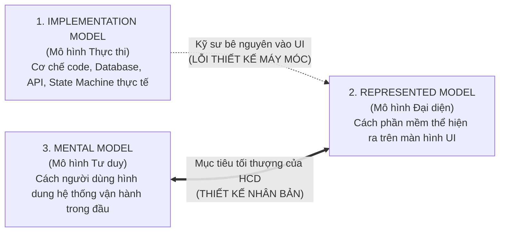
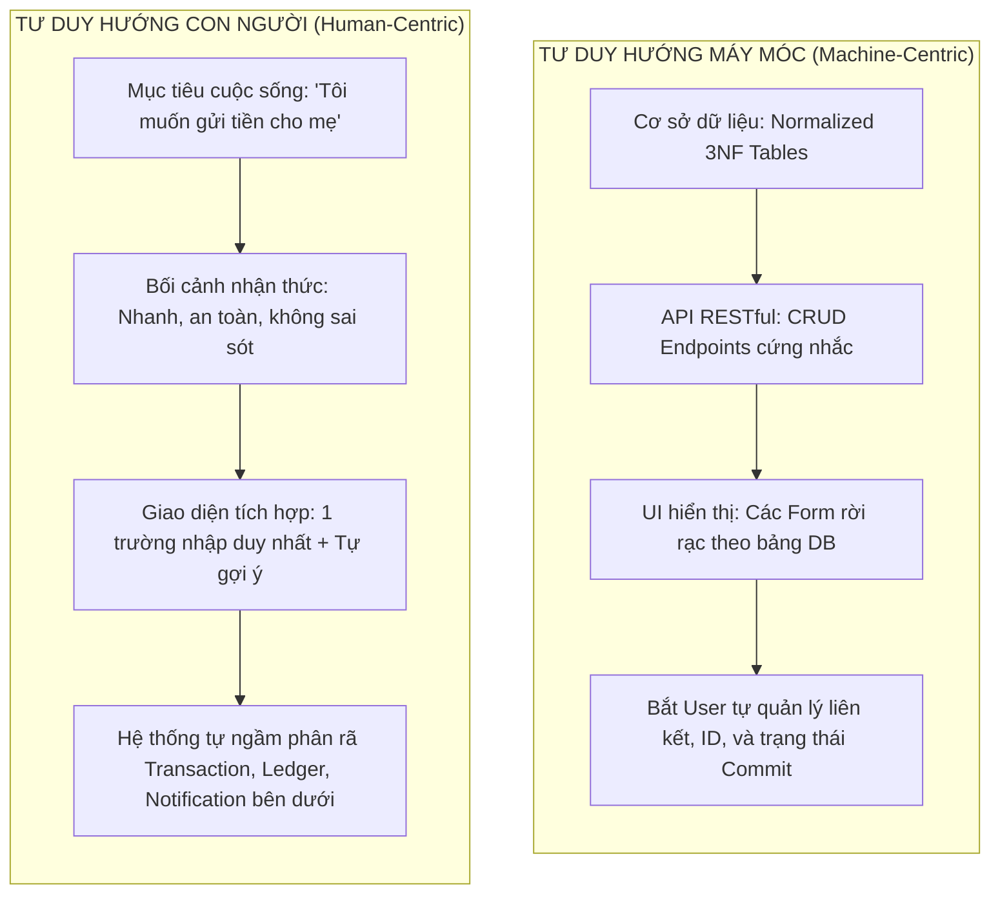

# GIẢI MÃ BẢN THỂ LUẬN VÀ TÂM LÝ HỌC NHẬN THỨC VỀ THIẾT KẾ PHI NHÂN TÍNH
## Nghiên cứu chuyên sâu về các Thiên kiến (Biases) và Lỗi tư duy (Fallacies) của Kỹ sư & Nhà thiết kế dẫn đến trải nghiệm người dùng (UX) "Máy móc", "Xa rời Bản tính Sinh học và Tâm lý học Tự nhiên của Con người"

* **Tác giả:** Nghiên cứu Độc lập về Tâm lý học Nhận thức, Công thái học Hành vi (Cognitive Ergonomics) & Human-Centered Design (HCD)
* **Thời gian hoàn thiện:** Tháng 09, 2026
* **Tài liệu lưu trữ:** `research-ux-cognitive-biases.md` (Obsidian Knowledge Vault)
* **Trường phái lý thuyết sơ cấp tham chiếu:**
  * **Cognitive Psychology & Behavioral Economics:** Daniel Kahneman, Amos Tversky, Herbert Simon, Barry Schwartz, Colin Camerer, George Loewenstein, Lee Ross.
  * **Human-Computer Interaction (HCI) & Interaction Design:** Don Norman, Alan Cooper, Jakob Nielsen, Stuart Card, Thomas P. Moran, Allen Newell.
  * **Human Factors & Engineering Psychology:** Christopher Wickens, Raja Parasuraman, Thomas Sheridan, Jens Rasmussen, Kathleen Mosier, Linda Skitka.

---

## MỤC LỤC HỆ THỐNG
1. [LỜI MỞ ĐẦU & TỔNG QUAN BẢN THỂ LUẬN (ONTOLOGICAL PROLOGUE)](#1-lời-mở-đầu--tổng-quan-bản-thể-luận)
2. [CƠ SỞ SINH HỌC THẦN KINH & TIẾN HÓA CỦA NÃO BỘ CON NGƯỜI](#2-cơ-sở-sinh-học-thần-kinh--tiến-hóa-của-não-bộ-con-người)
3. [CHỦ ĐỀ 1: LỜI NGUYỀN TRI THỨC & HIỆU ỨNG ĐỒNG THUẬN GIẢ](#3-chủ-đề-1-lời-nguyền-tri-thức--hiệu-ứng-đồng-thuận-giả)
4. [CHỦ ĐỀ 2: NGỤY BIỆN "NGƯỜI DÙNG DUY LÝ HOÀN HẢO" (RATIONAL AGENT FALLACY)](#4-chủ-đề-2-ngụy-biện-người-dùng-duy-lý-hoàn-hảo-rational-agent-fallacy)
5. [CHỦ ĐỀ 3: LOGIC HƯỚNG MÁY MÓC VS. MÔ HÌNH NHẬN THỨC CON NGƯỜI](#5-chủ-đề-3-logic-hướng-máy-móc-vs-mô-hình-nhận-thức-con-người)
6. [CHỦ ĐỀ 4: HAI KHOẢNG CÁCH TƯƠNG TÁC (GULF OF EXECUTION & EVALUATION)](#6-chủ-đề-4-hai-khoảng-cách-tương-tác-gulf-of-execution--evaluation)
7. [CHỦ ĐỀ 5: CUỘC CHIẾN HỆ THỐNG 1 VS. HỆ THỐNG 2 TRONG NHẬN THỨC SỐ](#7-chủ-đề-5-cuộc-chiến-hệ-thống-1-vs-hệ-thống-2-trong-nhận-thức-số)
8. [CHỦ ĐỀ 6: MA SÁT NHẬN THỨC (COGNITIVE FRICTION) & NGHỊCH LÝ LỰA CHỌN](#8-chủ-đề-6-ma-sát-nhận-thức-cognitive-friction--nghịch-lý-lựa-chọn)
9. [CHỦ ĐỀ 7: THIÊN KIẾN TỰ ĐỘNG HÓA & HỘI CHỨNG KIỆT QUỆ CẢNH BÁO](#9-chủ-đề-7-thiên-kiến-tự-động-hóa--hội-chứng-kiệt-quệ-cảnh-báo)
10. [CHỦ ĐỀ 8: VỰC THẲM KỲ DỊ TRONG TƯƠNG TÁC & THIÊN KIẾN THAO TÚNG ĐEN TỐI](#10-chủ-đề-8-vực-thẳm-kỳ-dị-trong-tương-tác--thiên-kiến-thao-túng-đen-tối)
11. [BẢNG ĐỐI CHIẾU TOÀN DIỆN: THIÊN KIẾN KỸ SƯ VS. NGUYÊN TẮC HCD ĐỐI TỰNG](#11-bảng-đối-chiếu-toàn-diện-thiên-kiến-kỹ-sư-vs-nguyên-tắc-hcd-đối-tượng)
12. [KHUNG PHƯƠNG PHÁP KHẮC PHỤC (DE-BIASING & COGNITIVE ERGONOMICS FRAMEWORK)](#12-khung-phương-pháp-khắc-phục-de-biasing--cognitive-ergonomics-framework)
13. [TÀI LIỆU THAM KHẢO SƠ CẤP (PRIMARY BIBLIOGRAPHY)](#13-tài-liệu-tham-khảo-sơ-cấp-primary-bibliography)

---

## 1. LỜI MỞ ĐẦU & TỔNG QUAN BẢN THỂ LUẬN

Nghịch lý lớn nhất của kỷ nguyên điện toán nằm ở chỗ: **Phần mềm được tạo ra để mở rộng năng lực của con người, nhưng phần lớn phần mềm lại vận hành như thể con người là một bộ vi xử lý silicon bị khiếm khuyết.**

Khi tương tác với các hệ thống số — từ cổng dịch vụ công, phần mềm doanh nghiệp (ERP/CRM), bảng điều khiển kỹ thuật (cloud consoles) cho đến các ứng dụng tiêu dùng — người dùng thường xuyên rơi vào trạng thái bất lực, căng thẳng nhận thức và ức chế sâu sắc. Họ bị buộc phải ghi nhớ những chuỗi ký tự vô nghĩa, bị trừng phạt bởi những thông báo lỗi đỏ rực mang mã số máy tính bí hiểm (`NullPointerException`, `Error 0x80004005`), và bị ép phải thực hiện các chuỗi thao tác cứng nhắc được thiết kế dựa trên cấu trúc bảng cơ sở dữ liệu quan hệ thay vì dòng tư duy tự nhiên của họ.

Hiện tượng này không phải là lỗi ngẫu nhiên về thẩm mỹ giao diện (UI aesthetics), mà bắt nguồn từ một **Sự Lệch Pha Tiến Hóa và Bản Thể Luận (Evolutionary & Ontological Mismatch)** sâu sắc:

```
┌────────────────────────────────────────────────────────────────────────┐
│                   SỰ LỆCH PHA TIẾN HÓA VÀ BẢN THỂ LUẬN                 │
├───────────────────────────┬────────────────────────────────────────────┤
│   BỘ NÃO CON NGƯỜI        │            HỆ THỐNG MÁY TÍNH               │
│   (Pleistocene Brain)     │            (Silicon Determinism)           │
├───────────────────────────┼────────────────────────────────────────────┤
│ • Xử lý tương tự (Analog) │ • Nhị phân rời rạc (Binary: 0 / 1)         │
│ • Nhận diện mẫu liên tưởng│ • Thực thi tuần tự, chính xác tuyệt đối    │
│ • Năng lượng cực kỳ hạn chế│ • Tiêu thụ điện năng, tính toán vô hạn     │
│ • Lối tắt Heuristic       │ • Thuật toán tất định (Deterministic logic)│
│ • Dễ mệt mỏi, phân tâm    │ • Bền bỉ, không có khái niệm suy kiệt      │
│ • Định hướng theo Mục tiêu│ • Định hướng theo Trạng thái & Thủ tục     │
└───────────────────────────┴────────────────────────────────────────────┘
```

Kỹ sư phần mềm và nhà thiết kế hệ thống, do được tôi luyện trong tư duy hình thức (formal logic), toán học rời rạc và kiến trúc máy tính, thường xuyên rơi vào những cái bẫy nhận thức tự nhiên. Họ vô thức phóng chiếu mô hình tư duy kỹ thuật của chính mình lên người dùng, hoặc giả định người dùng là một cỗ máy duy lý hoàn hảo. Kết quả là những sản phẩm "phi nhân tính" (inhuman UX) ra đời — những hệ thống vận hành trơn tru theo logic của máy móc nhưng xung đột trực diện với bản tính sinh học và tâm lý học hành vi của loài người.

---

## 2. CƠ SỞ SINH HỌC THẦN KINH & TIẾN HÓA CỦA NÃO BỘ CON NGƯỜI

Để thấu hiểu tại sao thiết kế máy móc lại thất bại, trước tiên phải nắm vững các giới hạn sinh học thép mà tự nhiên đã áp đặt lên nhận thức của con người qua hàng triệu năm tiến hóa:

### 2.1. Não bộ là một "Kẻ bủn xỉn nhận thức" (Cognitive Miser)
Theo nghiên cứu kinh điển của Susan Fiske và Shelley Taylor (1984), não bộ con người chỉ chiếm khoảng **2% trọng lượng cơ thể**, nhưng tiêu thụ tới **20% tổng năng lượng trao đổi chất cơ bản (Glucose và ATP)**. 
Về mặt sinh tồn tiến hóa, bất kỳ sinh vật nào lãng phí năng lượng thần kinh cho các tác vụ suy nghĩ phức tạp không phục vụ trực tiếp cho việc sinh tồn hay duy trì nòi giống đều bị chọn lọc tự nhiên đào thải. Do đó, bộ não tiến hóa để trở thành một thực thể cực kỳ tiết kiệm năng lượng:
* Nó luôn ưu tiên lối tắt nhận thức (*heuristics*), nhận diện mẫu quen thuộc và phản xạ vô thức.
* Nó ghét bỏ sự phức tạp không cần thiết, sự mơ hồ và mọi trạng thái đòi hỏi xử lý logic chuyên sâu kéo dài.
* Mọi thiết kế giao diện ép người dùng phải dừng lại để phân tích cấu trúc màn hình đều kích hoạt cơ chế kháng cự sinh học: mệt mỏi, thất vọng và xu hướng từ bỏ (*drop-off*).

### 2.2. Giới hạn thắt cổ chai của Bộ nhớ làm việc (Working Memory Bottleneck)
Trong công trình bản lề *"The Magical Number Seven, Plus or Minus Two"* (1956), nhà tâm lý học George Miller nhận định dung lượng bộ nhớ ngắn hạn của con người dao động trong khoảng $7 \pm 2$ đơn vị thông tin (*chunks*). 
Tuy nhiên, các nghiên cứu thần kinh học hiện đại nghiêm ngặt hơn của Nelson Cowan (2001) — *"The magical number 4 in short-term memory"* — đã chứng minh rằng khi loại bỏ các chiến lược ghi nhớ lặp lại (rehearsal), dung lượng bộ nhớ làm việc thực tế của con người **chỉ đạt từ 3 đến 5 chunks (trung bình là 4 chunks)**.
* **Hệ quả trong UX:** Khi một phần mềm yêu cầu người dùng phải ghi nhớ một mã số từ màn hình trước để nhập vào màn hình sau, hoặc hiển thị một bảng điều khiển với 15 thông số không có cấu trúc phân cấp, nó trực tiếp làm tràn bộ đệm thần kinh (*cognitive buffer overflow*), dẫn đến lỗi thao tác tất yếu.

### 2.3. Ba mô hình tương tác của Alan Cooper
Trong tác phẩm kinh điển *About Face: The Essentials of Interaction Design*, Alan Cooper đã vạch ra mô hình tam giác giải thích nguồn gốc của sự tha hóa giao diện:



* **Implementation Model (Mô hình Thực thi):** Cách thức cỗ máy thực sự vận hành bên dưới tầng mã nguồn — cách bộ nhớ phân bổ, cách cơ sở dữ liệu liên kết quan hệ 1-N, các lời gọi API RESTful hay microservices.
* **Mental Model (Mô hình Tư duy / Conceptual Model):** Mô hình tinh thần mà người dùng tự xây dựng trong tâm trí về cách công việc được thực hiện (ví dụ: "Tôi viết chữ vào một tờ giấy và cất vào ngăn kéo"). Mô hình này không liên quan gì đến con trỏ file, bảng nhị phân hay hệ số inode.
* **Represented Model (Mô hình Đại diện / Manifest Model):** Hình hài trực quan mà nhà thiết kế trình bày cho người dùng thấy thông qua giao diện.

> **Định luật Cooper:** *Mô hình đại diện càng tiệm cận với mô hình tư duy của người dùng, phần mềm càng dễ dùng và nhân bản. Ngược lại, khi mô hình đại diện phản ánh mô hình thực thi của kỹ sư, phần mềm trở thành một cỗ máy tra tấn nhận thức.*

---

## 3. CHỦ ĐỀ 1: LỜI NGUYỀN TRI THỨC & HIỆU ỨNG ĐỒNG THUẬN GIẢ

### 3.1. Nền tảng khoa học sơ cấp
* **The Curse of Knowledge (Lời nguyền của Tri thức):** Được định hình trong kinh tế học và tâm lý học bởi Colin Camerer, George Loewenstein và Martin Weber (1989) trong công trình *"The Curse of Knowledge in Economic Settings: An Experimental Analysis"*. Nghiên cứu chứng minh rằng khi một cá nhân đã nắm giữ một thông tin hoặc tri thức sâu sắc, họ hầu như **không có khả năng tái tạo lại trạng thái tinh thần của một người chưa biết gì**.
* **Thí nghiệm Elizabeth Newton (1990 - Stanford University):** Newton chia đối tượng thành hai nhóm: "Người gõ nhịp" (*tappers*) và "Người nghe" (*listeners*). Người gõ chọn một bài hát nổi tiếng (như *Happy Birthday*) và gõ nhịp ngón tay xuống mặt bàn, sau đó ước lượng xem người nghe có đoán được không.
  * Người gõ dự đoán rằng **50%** người nghe sẽ nhận ra bài hát (vì trong đầu họ, giai điệu và lời bài hát vang lên rộn rã theo từng nhịp gõ).
  * Kết quả thực tế: Chỉ có **2.5%** (3/120 lần) người nghe đoán đúng! Đối với người nghe, tiếng gõ ngón tay chỉ là những âm thanh cụt ngủn, rời rạc như mã Morse vô nghĩa.
* **False-Consensus Effect (Hiệu ứng Đồng thuận Giả):** Được chứng minh bởi Lee Ross, David Greene và Pamela House (1977) tại Stanford: Con người có xu hướng nhận thức sai lầm rằng niềm tin, thói quen, mức độ hiểu biết và phán đoán của mình là phổ quát và được đại đa số mọi người chia sẻ.

### 3.2. Biểu hiện bệnh lý trong kỹ thuật và thiết kế hệ thống
Kỹ sư phần mềm sống hàng tháng trời bên trong cấu trúc mã nguồn, hiểu rõ từng biến số, từng luồng dữ liệu và từng trường hợp biên (*edge case*). Do đó, đối với họ, luồng làm việc của hệ thống là "hoàn toàn tự nhiên và hiển nhiên".
Khi mắc phải Lời nguyền Tri thức và Hiệu ứng Đồng thuận Giả:
1. **Biệt ngữ Kỹ thuật xâm lấn UI (Technical Jargon Leaks):**
   * Hiển thị các thông báo như: *"Token expired, please re-authenticate"* (Thay vì: *"Phiên làm việc đã hết hạn, vui lòng đăng nhập lại"*).
   * *"Invalid UUID string"* (Người dùng phổ thông không biết UUID là gì, họ chỉ biết họ vừa gõ nhầm một ô nào đó).
   * Bắt người dùng lựa chọn các giao thức mạng, phương thức mã hóa, hoặc kiểu dữ liệu mà họ không có khái niệm.
2. **Khẩu hiệu tai hại: "Rõ ràng như thế này ai mà không hiểu!":**
   * Kỹ sư thường nói trong các buổi review: *"Nút này đặt ở góc trên bên phải, có icon bánh răng cưa, bấm vào là ra cấu hình JSON, có gì mà không hiểu?"*
   * Họ nghe thấy "giai điệu" của toàn bộ hệ thống kiến trúc trong đầu khi nhìn vào icon đó, trong khi người dùng bình thường chỉ nghe thấy tiếng "gõ bàn vô nghĩa".
3. **Ảo tưởng về "Documentation" (Tài liệu hướng dẫn):**
   * Cho rằng nếu hệ thống khó hiểu, giải pháp là viết thêm một file PDF hướng dẫn 80 trang hoặc xây dựng một trang Help Center đồ sộ. Đây là sự trốn tránh trách nhiệm thiết kế nhận thức.

---

## 4. CHỦ ĐỀ 2: NGỤY BIỆN "NGƯỜI DÙNG DUY LÝ HOÀN HẢO" (RATIONAL AGENT FALLACY)

### 4.1. Nền tảng khoa học sơ cấp
* **Bounded Rationality (Tính duy lý giới hạn) & Satisficing:** Nhà kinh tế học đạt giải Nobel Herbert A. Simon (1955, 1957) đã đập tan huyền thoại về "Homo Economicus" (Con người kinh tế duy lý tuyệt đối) bằng khái niệm Bounded Rationality. Con người bị giới hạn bởi:
  1. Năng lực xử lý thông tin hữu hạn của hệ thần kinh.
  2. Thời gian có hạn.
  3. Lượng thông tin thu thập được không bao giờ hoàn hảo.
  Thay vì tìm kiếm phương án tối ưu (*optimizing*), con người áp dụng chiến lược **Satisficing** (ghép giữa *Satisfy* và *Suffice*): Chọn ngay giải pháp đầu tiên đạt ngưỡng chấp nhận được, thay vì bỏ công sức tìm giải pháp hoàn hảo nhất.
* **Information Foraging Theory (Lý thuyết Tìm kiếm Thông tin Thức ăn):** Peter Pirolli và Stuart Card (1999) tại Xerox PARC chỉ ra rằng con người lướt web và dùng phần mềm tương tự như động vật săn mồi trong tự nhiên. Họ lần theo "mùi thông tin" (*information scent*). Nếu mùi thông tin bị loãng hoặc biến mất, họ sẽ đổi hướng ngay lập tức chứ không kiên nhẫn đọc tuần tự.
* **Jakob Nielsen (2000, 2008): "How Users Read on the Web":** Phân tích mắt đọc (*Eye-tracking*) chứng minh **người dùng không đọc từng từ**; họ quét lướt theo hình chữ F (*F-shaped pattern*). Họ chỉ đọc trung bình khoảng **20-28%** số chữ trên một trang web.

### 4.2. Ngụy biện "Người dùng Lý tưởng" của Kỹ sư
Hầu hết các phần mềm máy móc đều được thiết kế cho một thực thể giả tưởng gọi là "Người dùng Lý tưởng":
* Một người luôn đọc kỹ mọi dòng chữ trên màn hình.
* Một người luôn tỉnh táo 100%, không bị stress, không bị con quấy khóc, không bị sếp hối thúc.
* Một người kiên nhẫn đọc hết các hộp thoại cảnh báo dài 3 đoạn văn trước khi bấm nút xác nhận.
* Một người không bao giờ bấm nhầm, không bao giờ quên mật khẩu, và luôn ghi nhớ chính xác logic nghiệp vụ.

```
┌────────────────────────────────────────────────────────┐
│        NGỤY BIỆN "NGƯỜI DÙNG LÝ TƯỞNG" (IDEAL USER)    │
├───────────────────────────┬────────────────────────────┤
│ GIẢ ĐỊNH CỦA KỸ SƯ / DEV  │ THỰC TẾ SINH HỌC CỦA USER  │
├───────────────────────────┼────────────────────────────┤
│ Đọc tuần tự từ trên xuống │ Quét lướt tìm keyword (F)  │
│ Phân tích kỹ trước khi bấm│ Click thử sai (Trial & Err)│
│ Nhớ thông tin vô hạn      │ Quên ngay sau 5 giây       │
│ Năng lượng tập trung cao  │ Kiệt sức nhận thức (Stress)│
│ Đọc thông báo lỗi         │ Bấm "OK/Đóng" ngay lập tức │
└───────────────────────────┴────────────────────────────┘
```

### 4.3. Phân biệt Sai sót (Slips) và Sai lầm (Mistakes) theo Don Norman
Trong *The Design of Everyday Things*, Donald Norman khẳng định một chân lý bất hủ:
> **"Human error? No, bad design." (Lỗi do con người? Không, đó là thiết kế tồi).**

Norman chia lỗi con người thành hai bản chất sinh học hoàn toàn khác nhau:
1. **Slips (Sơ suất thao tác vô thức):** Người dùng có ý định đúng nhưng hành động vật lý bị chệch hướng do sự mất tập trung của tiềm thức. Ví dụ: bấm nhầm nút "Delete" nằm sát cạnh nút "Edit", hoặc gõ nhầm chữ vì hai phím gần nhau.
   * *Trách nhiệm thiết kế:* Hệ thống phải có cơ chế ngăn chặn vật lý (khoảng cách an toàn, xác nhận thông minh) và khả năng hoàn tác dễ dàng (*Undo*).
2. **Mistakes (Sai lầm nhận thức có chủ ý):** Người dùng hình thành một mục tiêu sai hoặc áp dụng sai phương pháp do Mô hình tư duy bị lệch lạc bởi hệ thống đánh lừa.
   * *Trách nhiệm thiết kế:* Phải cung cấp cấu trúc thông tin rõ ràng, minh bạch trạng thái để người dùng không suy luận sai.

Khi một kỹ sư đổ lỗi: *"Người dùng ngớ ngẩn làm sai quy trình"*, kỹ sư đó đang phủ nhận bản tính sinh học của loài người để bảo vệ sự lười biếng trong thiết kế của chính mình.

---

## 5. CHỦ ĐỀ 3: LOGIC HƯỚNG MÁY MÓC VS. MÔ HÌNH NHẬN THỨC CON NGƯỜI
### (Machine-Centric vs. Human-Centric Logic)

### 5.1. Hội chứng "Thủng tầng trừu tượng" (Leaky Abstractions) trong UX
Joel Spolsky (2002) đã đặt ra *Luật về các Tầng trừu tượng bị thủng* (*The Law of Leaky Abstractions*): Mọi sự trừu tượng hóa phi tầm thường trong khoa học máy tính đều có lúc bị rò rỉ cơ chế bên dưới lên bề mặt.
Trong thiết kế phần mềm, căn bệnh trầm kha của kỹ sư là **để rò rỉ kiến trúc cơ sở dữ liệu và API trực tiếp lên giao diện người dùng**:

#### Ví dụ 1: Ép người dùng tuân theo ràng buộc khóa ngoại (Foreign Key Constraints)
* **Tư duy máy tính (Database schema):** Bảng `Invoice` có khóa ngoại trỏ tới `Customer_ID`. Bảng `Customer` lại có khóa ngoại trỏ tới `Tax_Code_Region`.
* **Trải nghiệm máy móc:** Người dùng muốn lập nhanh một hóa đơn bán lẻ. Hệ thống hiện lỗi: *"Không thể tạo Hóa đơn vì Khách hàng chưa tồn tại. Vui lòng chuyển sang Phân hệ Khách hàng -> Thêm mới Khách hàng -> Nhập Mã vùng thuế -> Lưu -> Quay lại Hóa đơn."*
* **Mô hình tư duy con người:** *"Tôi đang bán một cốc cà phê cho một người lạ, tôi muốn ghi nhận số tiền ngay lập tức, tên họ có thể cập nhật sau hoặc không cần thiết!"*

#### Ví dụ 2: Lộ cơ chế Phân trang và Tải dữ liệu (Offset Pagination vs Spatial Navigation)
* **Tư duy máy móc:** Phân trang kiểu `SELECT * FROM items LIMIT 20 OFFSET 40;` dẫn đến giao diện `Trang 1 | Trang 2 | Trang 3 ... Trang 148`.
* **Trải nghiệm máy móc:** Ép người dùng phải đoán xem món hàng hoặc tài liệu họ cần tìm 3 ngày trước nằm ở "Trang 4" hay "Trang 7", hoàn toàn phá hủy trí nhớ không gian (*spatial memory*) của con người.

#### Ví dụ 3: Hệ quả của mô hình giao dịch ACID (Save Buttons & Commit Anxiety)
* **Tư duy máy tính:** Dữ liệu chỉ được ghi xuống đĩa khi có lệnh `COMMIT`. Do đó sinh ra các form biểu mẫu dài 50 trường với nút "Lưu thay đổi" nằm tận đáy trang. Nếu mạng rớt hoặc người dùng vô tình bấm F5 trước khi bấm Lưu, toàn bộ công sức biến mất.
* **Mô hình nhận thức tự nhiên:** Con người viết chữ trên giấy, nét mực in ngay lập tức. Các hệ thống hiện đại nhân bản buộc phải áp dụng cơ chế tự động lưu liên tục (*Optimistic UI updates & Continuous Autosave*).



---

## 6. CHỦ ĐỀ 4: HAI KHOẢNG CÁCH TƯƠNG TÁC (GULF OF EXECUTION & EVALUATION)

Donald Norman (1986, 1988) đã đặt nền móng cho lý thuyết công thái học nhận thức với **Mô hình 7 Giai đoạn Hành động (Seven Stages of Action)** và chỉ ra hai "hố sâu ngăn cách" khiến con người bị cô lập khỏi công nghệ:

```
                      ┌────────────────────────┐
                      │    MỤC TIÊU CỦA USER   │
                      │         (GOAL)         │
                      └───────────┬────────────┘
                                  │
         ┌────────────────────────┴────────────────────────┐
         ▼                                                 ▼
┌─────────────────────────┐                       ┌─────────────────────────┐
│   GULF OF EXECUTION     │                       │    GULF OF EVALUATION   │
│   (Khoảng cách Thực thi)│                       │   (Khoảng cách Đánh giá)│
├─────────────────────────┤                       ├─────────────────────────┤
│ Làm sao tôi biết được:  │                       │ Làm sao tôi biết được:  │
│ 1. Hệ thống làm được gì?│                       │ 1. Chuyện gì vừa xảy ra?│
│ 2. Làm thế nào để thực  │                       │ 2. Thao tác có thành    │
│    hiện ý định?         │                       │    công hay không?      │
│ 3. Bấm vào đâu?         │                       │ 3. Trạng thái hiện tại  │
│                         │                       │    của hệ thống là gì?  │
└────────────┬────────────┘                       └────────────▲────────────┘
             │                                                 │
             ▼                                                 │
      [HÀNH ĐỘNG VẬT LÝ]                              [PHẢN HỒI HỆ THỐNG]
      (Physical Action)                                (System Feedback)
             │                                                 │
             └────────────────► [CỖ MÁY SỐ] ───────────────────┘
                                (The System)
```

### 6.1. Chi tiết Gulf of Execution (Khoảng cách Thực thi)
Khoảng cách này đo lường mức độ khó khăn khi người dùng cố gắng chuyển dịch **Ý định tinh thần (Mental Intention)** thành **Thao tác vật lý (Physical Action)** trên giao diện.
Nó bị khoét sâu bởi các lỗi tư duy sau của kỹ sư:
1. **Thiếu Khả năng gợi mở (Affordance) và Dấu hiệu nhận biết (Signifier):**
   * *Khái niệm của J.J. Gibson (1979) và Norman (1988):* Affordance là thuộc tính tương tác tiềm năng của vật thể (nút thì có thể bấm, thanh kéo thì có thể trượt). Signifier là dấu hiệu thị giác báo cho người dùng biết thao tác có thể thực hiện ở đâu.
   * *Căn bệnh của thiết kế máy móc hoặc "Flat Design cực đoan":* Loại bỏ hoàn toàn đổ bóng, đường viền, biến các nút bấm (Buttons) thành các dòng chữ trơ trọi. Người dùng nhìn vào một màn hình phẳng lì và không biết chỗ nào click được, chỗ nào là văn bản tĩnh.
2. **Ánh xạ tồi tệ (Bad Mapping):**
   * Sự không tương thích giữa vị trí của nút điều khiển vật lý và vị trí của vật thể bị tác động. Ví dụ kinh điển của Norman: 4 núm vặn bếp ga xếp thành một hàng ngang thẳng tắp để điều khiển 4 bếp nấu xếp theo hình vuông $2 	imes 2$. Người dùng buộc phải học thuộc lòng thay vì nhìn thấy một ánh xạ tự nhiên (*natural spatial mapping*).
3. **Thiếu Ràng buộc logic và vật lý (Constraints):**
   * Cho phép người dùng nhập tự do chữ cái vào trường "Số điện thoại", để rồi sau khi họ bấm Submit mới hiện thông báo lỗi: *"Số điện thoại chỉ được chứa chữ số"*. Một thiết kế nhân bản sử dụng ràng buộc để ngăn ngừa lỗi ngay từ bàn phím (không cho gõ ký tự lạ).

### 6.2. Chi tiết Gulf of Evaluation (Khoảng cách Đánh giá)
Khoảng cách này đo lường mức độ khó khăn khi người dùng cố gắng **nhận biết, giải thích và so sánh** trạng thái thực tế của hệ thống với mục tiêu ban đầu của họ.
Nó trở thành vực thẳm do:
1. **Hệ thống là "Hộp đen câm nín" (Feedback Black Hole):**
   * Người dùng bấm nút "Thanh toán" hoặc "Tải lên". Màn hình đứng im, con trỏ chuột không đổi hình dạng, không có thanh tiến trình (*progress bar*), không có hiệu ứng phản hồi.
   * *Ngưỡng sinh học thần kinh (Miller 1968; Card, Moran & Newell 1983 - Model Human Processor):*
     * **0.1 giây (100ms):** Giới hạn phản xạ để người dùng cảm thấy hệ thống phản hồi tức thì.
     * **1.0 giây:** Giới hạn để dòng suy nghĩ của người dùng không bị gián đoạn.
     * **10 giây:** Giới hạn tối đa của sự tập trung. Quá 10 giây mà không có phản hồi tiến độ, người dùng sẽ cho rằng hệ thống đã chết và bắt đầu bấm loạn xạ, tải lại trang hoặc thoát ứng dụng.
2. **Trạng thái mơ hồ, đánh đố:**
   * Thông báo thành công chung chung: *"Yêu cầu của bạn đã được tiếp nhận"*. Nhưng tiếp nhận là khi nào xử lý? Tiền đã trừ chưa? Đơn hàng đang ở kho hay đang chờ duyệt? Người dùng bị rơi vào trạng thái bất định (*anxiety of uncertainty*).

---

## 7. CHỦ ĐỀ 5: CUỘC CHIẾN HỆ THỐNG 1 VS. HỆ THỐNG 2 TRONG NHẬN THỨC SỐ
### (Kahneman - Thinking, Fast and Slow trong HCI)

### 7.1. Khung lý thuyết tiến hóa của Daniel Kahneman & Amos Tversky
Trong tác phẩm đồ sộ *Thinking, Fast and Slow* (2011), Daniel Kahneman tổng kết lý thuyết hai hệ thống xử lý nhận thức (Dual-Process Theory):

```
┌────────────────────────────────────────────────────────┐
│             HAI HỆ THỐNG NHẬN THỨC (KAHNEMAN)          │
├───────────────────────────┬────────────────────────────┤
│   HỆ THỐNG 1 (SYSTEM 1)   │   HỆ THỐNG 2 (SYSTEM 2)    │
│   "Nhanh, Tự động, Ít hao"│   "Chậm, Tính toán, Đắt đỏ"│
├───────────────────────────┼────────────────────────────┤
│ • Vận hành vô thức        │ • Đòi hỏi sự chú ý có ý thức│
│ • Nhận diện mẫu tức thì   │ • Suy luận logic phức tạp  │
│ • Tiêu thụ năng lượng cực thấp│ • Tiêu thụ cực nhiều Glucose│
│ • Dựa trên cảm xúc, thói quen│ • Nhanh chóng bị kiệt quệ │
│ • Luôn luôn bật (Default) │ • Thường lười biếng, nghỉ ngơi│
└───────────────────────────┴────────────────────────────┘
```

### 7.2. Tội ác thiết kế: Cưỡng bức kích hoạt Hệ thống 2
Bản tính tự nhiên của con người là điều hướng thế giới bằng **Hệ thống 1**. Khi lái xe trên con đường quen thuộc, chúng ta không cần tính toán góc quay vô lăng; đôi tay tự điều khiển.
Một phần mềm nhân bản là phần mềm cho phép người dùng vận hành bằng Hệ thống 1 cho **90% tác vụ thông thường**, và chỉ mời gọi Hệ thống 2 tham gia khi cần đưa ra những quyết định sinh tử hoặc thực sự phức tạp.

Tuy nhiên, các hệ thống máy móc liên tục **cưỡng bức người dùng phải bật Hệ thống 2** cho những việc vặt vãnh nhất:

#### 1. Bắt người dùng ghi nhớ trạng thái thay vì nhận diện trực quan (Recall vs. Recognition)
* *Cơ sở tâm lý học:* Nhận diện (Recognition - System 1) dựa trên kích thích thị giác trực tiếp; Gợi nhớ (Recall - System 2) đòi hỏi não bộ phải tự tái tạo thông tin từ vùng nhớ trống rỗng.
* *Thiết kế tồi:* Bắt người dùng nhớ mã kho hàng, mã SKU, mã bưu chính, hoặc cấu trúc câu lệnh dòng lệnh phức tạp.
* *Thiết kế nhân bản (Jakob Nielsen Heuristic #6):* Cung cấp danh sách tìm kiếm gợi ý tự động (Typeahead / Autocomplete), hiển thị hình ảnh sản phẩm song song với tên gọi.

#### 2. Ép người dùng giải mã các Biểu tượng trừu tượng (Mystery Meat Navigation)
* Kỹ sư và nhà thiết kế thường thích sự tối giản thị giác nên thay thế các nút có chữ bằng một loạt icon "độc lạ".
* Người dùng nhìn vào một thanh công cụ gồm 10 biểu tượng hình học kỳ quái và Hệ thống 2 phải gồng mình hoạt động: *"Biểu tượng cái phễu này nghĩa là 'Lọc dữ liệu' hay là 'Rót dầu'? Biểu tượng cái kẹp giấy là 'Đính kèm' hay là 'Ghim lên đầu trang'?"*

#### 3. Trạng thái "Cognitive Ease" (Dễ dàng nhận thức) vs. "Cognitive Strain" (Căng thẳng nhận thức)
* Kahneman chứng minh rằng khi ở trạng thái **Cognitive Ease** (phông chữ dễ đọc, màu sắc tương phản chuẩn, cấu trúc đối xứng, ngôn ngữ quen thuộc), con người cảm thấy thoải mái, tin cậy, trực giác hoạt động tốt và đưa ra quyết định nhanh chóng.
* Khi bị đẩy vào trạng thái **Cognitive Strain** (chữ nhỏ li ti, tương phản kém, bố cục hỗn loạn, thuật ngữ kỳ dị), nhịp tim người dùng tăng lên, đồng tử giãn ra, sự nghi ngờ và tâm lý phòng thủ xuất hiện. Họ cảm thấy bị đe dọa bởi chính phần mềm họ đang sử dụng.

---

## 8. CHỦ ĐỀ 6: MA SÁT NHẬN THỨC (COGNITIVE FRICTION) & NGHỊCH LÝ LỰA CHỌN

### 8.1. Ma sát Nhận thức (Cognitive Friction) theo Alan Cooper
Trong *The Inmates Are Running the Asylum* (1999), Alan Cooper định nghĩa:
> **Cognitive Friction** là lực cản vô hình mà một trí tuệ con người vấp phải khi cố gắng thay đổi trạng thái hoặc định hướng chuyển động của một công cụ nhân tạo không tuân theo các phản hồi tự nhiên.

Ma sát nhận thức cao xảy ra khi một hệ thống có hành vi không thể dự đoán được dựa trên kinh nghiệm sống thực tế. Trong thế giới vật lý, nếu bạn đẩy một hòn đá, nó lăn về phía trước. Trong thế giới phần mềm máy móc, bạn bấm nút "Next", nhưng màn hình lại nhảy về trang chủ vì một trường nhập liệu ẩn ở cuối trang chưa được điền. Sự phi lý này tích tụ ma sát nhận thức, biến người dùng thành những "nạn nhân bị hành hạ thần kinh".

### 8.2. Nghịch lý Lựa chọn (The Paradox of Choice) theo Barry Schwartz
Năm 2004, nhà tâm lý học xã hội Barry Schwartz xuất bản cuốn sách chấn động *The Paradox of Choice: Why More Is Less*. Ông thách thức giáo điều cốt lõi của xã hội công nghiệp: *"Càng nhiều lựa chọn, con người càng tự do và hạnh phúc."*

Schwartz chứng minh rằng sự bùng nổ của các lựa chọn dẫn đến 3 thảm họa tâm lý:
1. **Tê liệt Quyết định (Decision Paralysis):** Khi có quá nhiều phương án, con người thấy chi phí nhận thức để so sánh vượt quá lợi ích nhận được, dẫn đến việc họ trì hoãn hoặc từ bỏ hoàn toàn việc lựa chọn.
2. **Chi phí Cơ hội & Sự Hối tiếc (Opportunity Costs & Post-Decision Regret):** Càng có nhiều lựa chọn bị bỏ qua, người dùng càng dễ tưởng tượng ra những ưu điểm của các phương án bị loại, dẫn đến sự hối tiếc gặm nhấm ngay cả khi lựa chọn của họ rất tốt.
3. **Kỳ vọng leo thang phi thực tế (Escalation of Expectations):** Khi chỉ có 2 lựa chọn, nếu sản phẩm có khuyết điểm, người dùng trách hoàn cảnh. Khi có 200 lựa chọn, nếu sản phẩm không hoàn hảo 100%, người dùng tự trách mình hoặc căm ghét thương hiệu.

```
Mức độ Thỏa mãn
      ▲
      │           Đỉnh tối ưu
      │             (Sweet Spot)
      │                ╭───╮
      │               ╭╯   ╰╮
      │              ╭╯     ╰╮  Vùng Tê liệt & Hối tiếc
      │             ╭╯       ╰───────────────────────►
      │            ╭╯         (The Paradox of Choice)
      │           ╭╯
      │          ╭╯
      └─────────┴────────────────────────────────────► Số lượng Lựa chọn
                Ít                               Nhiều
```

### 8.3. Định luật Hick-Hyman (Hick's Law)
Được thiết lập thực nghiệm bởi William Edmund Hick (1952) và Ray Hyman (1953), định luật mô tả thời gian một người cần để đưa ra quyết định ($T$) tỷ lệ thuận với logarit cơ số 2 của số lượng lựa chọn ($n$):

$$T = b \cdot \log_2(n + 1)$$

*Trong đó $b$ là hằng số xử lý nhận thức.*

* **Lỗi thiết kế máy móc của Kỹ sư:** "Cung cấp càng nhiều tính năng càng tốt, hãy để hết ra ngoài cho người dùng tự chọn!" Kết quả là một màn hình cài đặt có 80 checkbox, một menu cấp 1 có 25 mục rủ xuống, đẩy thời gian xử lý và tải nhận thức lên mức tối đa.
* **Biện pháp cứu chữa:** 
  * **Progressive Disclosure (Tiết lộ Lũy tiến):** Chỉ hiển thị các lựa chọn cơ bản cốt lõi; các tùy chọn nâng cao chỉ xuất hiện khi người dùng chủ động yêu cầu.
  * **Opinionated Defaults (Thiết lập mặc định có chính kiến):** Nghiên cứu để đưa ra cấu hình mặc định tối ưu nhất cho 85% người dùng, giải phóng họ khỏi áp lực lựa chọn.

---

## 9. CHỦ ĐỀ 7: THIÊN KIẾN TỰ ĐỘNG HÓA & HỘI CHỨNG KIỆT QUỆ CẢNH BÁO

### 9.1. Automation Bias (Thiên kiến Tự động hóa)
* **Nền tảng sơ cấp:** Raja Parasuraman, Thomas B. Sheridan, Christopher D. Wickens (2000) - *"A model for types and levels of human interaction with automation"*; Kathleen L. Mosier và Linda J. Skitka (1996, 1999).
* **Bản chất:** Con người có xu hướng tâm lý ỷ lại một cách vô thức vào các phán đoán hoặc đề xuất của hệ thống tự động/thuật toán, coi máy tính là thực thể khách quan, vô tư và ít sai sót hơn con người.
* **Hai dạng sai lầm nghiêm trọng:**
  1. **Errors of Omission (Lỗi Bỏ sót):** Người dùng lơ là giám sát, không nhận ra các trục trặc hoặc dấu hiệu cảnh báo nguy hiểm trong thế giới thực vì "hệ thống tự động chưa thấy báo gì".
  2. **Errors of Commission (Lỗi Làm theo mù quáng):** Người dùng thực thi quyết định sai lầm theo chỉ thị của máy tính, ngay cả khi các bằng chứng trực quan xung quanh hoặc trực giác mách bảo rằng cỗ máy đang sai.
* **Nguy cơ hiện đại trong kỷ nguyên AI:** Người dùng tin tưởng tuyệt đối vào các câu trả lời tự tin của Large Language Models (LLMs) ngay cả khi mô hình đang "ảo giác" (*hallucination*), dẫn đến sự suy giảm năng lực tư duy phản biện.

### 9.2. Alert Fatigue & Hiệu ứng "Cậu bé chăn cừu" (Cry-Wolf Effect)
* **Nền tảng sơ cấp:** Shlomo Breznitz (1984) - *Cry Wolf: The Psychology of False Alarms*.
* **Cơ chế Sinh học Thần kinh - Hiện tượng Thích ứng Thụ cảm (Sensory Habituation):** 
  Khi một kích thích thị giác hoặc thính giác lặp đi lặp lại với tần suất cao nhưng không mang lại hệ quả sinh tồn tiêu cực thực tế, hệ thống thần kinh trung ương của con người sẽ tự động ức chế tín hiệu đó để tiết kiệm tài nguyên xử lý.
* **Biểu hiện phá hủy trong Thiết kế Phần mềm:**
  1. **Hộp thoại xác nhận vô nghĩa (The "Are You Sure?" Disease):**
     * Kỹ sư sợ chịu trách nhiệm nên với mọi thao tác xóa, sửa, lưu, họ đều bật popup: *"Bạn có chắc chắn muốn làm điều này không?"*
     * Ban đầu, người dùng đọc. Sau lần thứ 50, não bộ hình thành phản xạ vận động tiềm thức: Ngón tay tự động rê chuột bấm "Yes/OK" trước khi vỏ não kịp đọc nội dung cảnh báo.
     * Hậu quả: Khi một cảnh báo xóa dữ liệu hệ thống vĩnh viễn thực sự xuất hiện, người dùng vẫn bấm "Yes" theo quán tính, rồi kinh hoàng nhận ra dữ liệu đã mất sạch!
  2. **Hội chứng Chấp nhận Cookie & Cảnh báo Bảo mật:**
     * Sự lạm dụng các banner GDPR, pop-up xin quyền vị trí, thông báo newsletter đã biến người dùng thành những cỗ máy click "Accept All / Bỏ qua" mà không hề có nhận thức bảo mật.

```
Tần suất Cảnh báo
      ▲
      │
      │ ▓▓▓▓▓▓▓▓▓▓▓▓▓▓▓▓▓▓▓▓▓▓▓▓▓▓▓▓▓▓▓▓▓▓▓▓▓▓▓
      │ ▓ CẢNH BÁO LIÊN TỤC VỚI MỨC ƯU TIÊN THẤP ▓
      │ ▓▓▓▓▓▓▓▓▓▓▓▓▓▓▓▓▓▓▓▓▓▓▓▓▓▓▓▓▓▓▓▓▓▓▓▓▓▓▓
      │                     │
      │                     ▼ (Kích hoạt Ức chế Thần kinh / Habituation)
      │ ┌────────────────────────────────────────────────────────┐
      │ │ PHẢN XẠ "BẤM OK TRONG VÔ THỨC" (Automatic Dismissal)   │
      │ └───────────────────┬────────────────────────────────────┘
      │                     │
      │                     ▼ (Khi Sự cố Thảm họa Thực sự Xuất hiện)
      │ 💥 [MẤT DỮ LIỆU / TAI NẠN HỆ THỐNG / THẢM HỌA KHÔNG ĐẢO NGƯỢC]
      └──────────────────────────────────────────────────────────────► Thời gian
```

---

## 10. CHỦ ĐỀ 8: VỰC THẲM KỲ DỊ TRONG TƯƠNG TÁC & THIÊN KIẾN THAO TÚNG ĐEN TỐI

### 10.1. Uncanny Valley of Interaction (Vực thẳm Kỳ dị trong Tương tác)
* **Nguồn gốc:** Giáo sư robot học Masahiro Mori (1970) đưa ra khái niệm *Bukimi no Tani Genshō* (The Uncanny Valley): Khi một thực thể nhân tạo càng giống con người về mặt ngoại hình, mức độ thiện cảm tăng lên; nhưng khi nó giống gần như hoàn hảo mà vẫn còn những nét cử động đơ cứng, giả tạo, mức độ thiện cảm rơi tự do xuống vực thẳm của sự ghê sợ và kinh tởm (*revulsion*).
* **Mở rộng sang Tương tác Phần mềm và AI (Conversational UX):**
  * Nhiều nhà phát triển cố gắng nhồi nhét sự nhân cách hóa gượng ép vào chatbot và trợ lý ảo: bắt bot xưng "em", giả vờ hiển thị hiệu ứng "đang gõ phím..." trong 3 giây để trông giống người thật, thêm các câu đùa cợt vô duyên.
  * Khi người dùng đang gặp sự cố nghiêm trọng (ví dụ: bị khóa tài khoản ngân hàng lúc nửa đêm) và phải đối diện với một con bot giả vờ vui tươi, thiếu khả năng thấu cảm thực sự nhưng lại từ chối kết nối với nhân viên trực tổng đài, người dùng rơi thẳng vào **Vực thẳm Kỳ dị của Tương tác**. Họ cảm thấy bị xúc phạm, bị chế giễu và mất niềm tin hoàn toàn vào thương hiệu.

### 10.2. Dark Patterns & Sự Thao túng Thiên kiến Nhận thức (Deceptive Biases)
Nếu các lỗi tư duy trên là do sự vô tình của kỹ sư, thì **Dark Patterns (Các mẫu thiết kế lừa đảo / Deceptive Patterns)** — thuật ngữ được đặt ra bởi Harry Brignull (2010) — là sự vũ khí hóa có chủ đích các thiên kiến tâm lý học nhận thức nhằm trục lợi từ người dùng:

```
┌─────────────────────────────────────────────────────────────────────────┐
│                    VŨ KHÍ HÓA CÁC THIÊN KIẾN NHẬN THỨC                  │
├──────────────────────────┬──────────────────────────────┬───────────────┤
│ THIÊN KIẾN TÂM LÝ BỊ BẮT │ TÊN DARK PATTERN THƯỜNG GẶP  │ CƠ CHẾ THAO   │
│ BỚT (COGNITIVE VULNERAB.)│ (BRIGNULL / MATHUR ET AL.)   │ TÚNG THỰC TẾ  │
├──────────────────────────┼──────────────────────────────┼───────────────┤
│ Default Bias / Status Quo│ Pre-ticked Opt-ins / Sneak   │ Tự động tích  │
│ Bias (Samuelson 1988)    │ into Basket                  │ chọn mua thêm │
│                          │                              │ gói bảo hiểm  │
├──────────────────────────┼──────────────────────────────┼───────────────┤
│ Sunk Cost Fallacy &      │ Roach Motel / Obstruction    │ Đăng ký 1-click│
│ Friction Asymmetry       │ (Bẫy Gián)                   │ nhưng hủy phải│
│                          │                              │ gọi điện thoại│
├──────────────────────────┼──────────────────────────────┼───────────────┤
│ Loss Aversion            │ Confirmshaming               │ Dùng từ ngữ:  │
│ (Kahneman & Tversky 1979)│                              │ "Không, tôi   │
│                          │                              │ ghét tiết kiệm"│
├──────────────────────────┼──────────────────────────────┼───────────────┤
│ Scarcity Heuristic       │ Fake Urgency & False Social  │ Bộ đếm ngược  │
│ (Cialdini 1984)          │ Proof                        │ ảo, thông báo │
│                          │                              │ "5 người mua" │
└──────────────────────────┴──────────────────────────────┴───────────────┘
```

* **Sludge (Chất thải nhận thức):** Cass Sunstein (2019) định nghĩa *Sludge* là sự cố tình tạo ra ma sát nhận thức, thủ tục rườm rà và các rào cản tâm lý để ngăn cản con người thực hiện các quyền lợi chính đáng của họ (ví dụ: giấu nút hủy gói thuê bao sâu dưới 6 tầng menu cài đặt).

---

## 11. BẢNG ĐỐI CHIẾU TOÀN DIỆN: THIÊN KIẾN KỸ SƯ VS. NGUYÊN TẮC HCD ĐỐI TỰNG

| # | Thiên kiến / Lỗi tư duy của Kỹ sư | Nguồn gốc lý thuyết sơ cấp | Triệu chứng trong UX Máy móc | Nguyên tắc HCD Khắc phục (Antidote) |
|---|---|---|---|---|
| **1** | **Curse of Knowledge** | Camerer et al. (1989), Newton (1990) | Lộ thuật ngữ backend, mã lỗi nội bộ, viết UI theo tư duy của người đã hiểu code. | **Plain Language & Speak the User's Language** (ISO 9241-110 Nguyên tắc 2; Nielsen Heuristic #2). |
| **2** | **False-Consensus Effect** | Ross, Greene, & House (1977) | Giả định "Tôi thấy dễ dùng thì user cũng thấy dễ dùng", bỏ qua testing. | **Empirical User Testing:** "You are not the user." Kiểm thử thực nghiệm với người dùng thật. |
| **3** | **Rational Agent Fallacy** | Simon (1955), Pirolli & Card (1999) | Biểu mẫu khổng lồ, bắt đọc tài liệu dài dòng, đổ lỗi khi user bấm sai. | **Satisficing-Ready Design:** Thiết kế cho quét lướt (scanning), Progressive Disclosure, Chunky info. |
| **4** | **Leaky Abstractions** | Spolsky (2002), Cooper (1999) | Ép người dùng nhập liệu theo đúng quan hệ bảng DB (Khóa ngoại, ID, Entity con). | **Mental Model First:** Giao diện phản ánh mô hình tư duy thế giới thực, trừu tượng hóa DB bên dưới. |
| **5** | **Gulf of Execution** | Norman (1986, 1988) | Giao diện phẳng lì, thiếu Affordance, nút bấm không ra nút, không biết làm sao thực hiện. | **Visible Signifiers & Natural Mappings:** Đảm bảo khả năng tương tác rõ ràng, có chỉ dẫn trực giác. |
| **6** | **Gulf of Evaluation** | Norman (1986, 1988), Miller (1968) | Giao diện câm nín khi click, không báo trạng thái, không biết đã lưu thành công hay thất bại. | **Immediate Continuous Feedback:** Phản hồi dưới 100ms, trạng thái hệ thống minh bạch (Nielsen #1). |
| **7** | **System 2 Overload** | Kahneman & Tversky (1974, 2011) | Bắt người dùng nhớ mã số, tính nhẩm dữ liệu, giải mã icon kỳ dị không có nhãn chữ. | **Recognition over Recall:** Tận dụng System 1, cung cấp gợi ý tự động, gán nhãn chữ tường minh cho icon. |
| **8** | **Choice Overload** | Schwartz (2004), Hick (1952) | Bày ra 50 tính năng cùng lúc, dropdown menu vô tận, không có thiết lập mặc định. | **Hick's Law Optimization:** Hạn chế số lượng lựa chọn cùng lúc, cung cấp Opinionated Defaults thông minh. |
| **9** | **Alert Fatigue & Habituation** | Breznitz (1984), Mosier & Skitka (1996) | Hiện popup "Bạn có chắc chắn?" cho mọi thao tác nhỏ, biến việc bấm OK thành phản xạ vô thức. | **Reversibility over Confirmation:** Thay thế popup hỏi bằng tính năng Hoàn tác (*Undo*) nhẹ nhàng. |
| **10**| **Uncanny Interaction** | Mori (1970) | Chatbot giả tạo xưng hô ướt át nhưng trả lời ngô nghê, che giấu giới hạn thực tế của máy móc. | **Honest Anthropomorphism:** Minh bạch năng lực của AI, khiêm tốn, chuyển giao người thật kịp thời. |

---

## 12. KHUNG PHƯƠNG PHÁP KHẮC PHỤC (DE-BIASING & COGNITIVE ERGONOMICS FRAMEWORK)

Để triệt tiêu các thiên kiến máy móc khỏi tư duy kỹ thuật, đội ngũ phát triển cần thiết lập một khung quy trình kỷ luật nhận thức nghiêm ngặt:

### 12.1. Quy trình Cognitive Walkthrough 4 câu hỏi (Wharton et al., 1994)
Trước khi phát hành bất kỳ một màn hình tương tác nào, kỹ sư và designer phải cùng nhau trả lời 4 câu hỏi định chuẩn nhận thức tại từng bước thao tác:
1. **User có cố gắng đạt được hiệu quả tương ứng với hành động này không?** *(Ý định của user có trùng với bước này không?)*
2. **User có thấy được công cụ/nút bấm để thực hiện hành động này không?** *(Signifier có hiển thị rõ không, hay bị giấu trong menu con?)*
3. **User có liên kết được công cụ/nút bấm đó với kết quả mong muốn không?** *(Nhãn chữ có dễ hiểu không, hay dùng thuật ngữ backend?)*
4. **Sau khi hành động, user có thấy tiến trình đang diễn ra đúng hướng không?** *(Phản hồi hệ thống có tức thì và rõ ràng không?)*

### 12.2. Nguyên tắc "Cognitive Poka-Yoke" (Chống lỗi Nhận thức)
Bắt nguồn từ nguyên lý sản xuất của Shigeo Shingo tại Toyota (Poka-Yoke = Chống sai sót), trong phần mềm, giao diện phải được thiết kế sao cho **người dùng không thể làm sai ngay cả khi họ muốn làm sai**:
* Làm mờ (*Disable*) hoặc ẩn các tùy chọn không hợp lệ trong bối cảnh hiện tại.
* Tự động định dạng dữ liệu (ví dụ: tự thêm dấu cách khi người dùng nhập số điện thoại hoặc số thẻ tín dụng).
* Xây dựng kiến trúc giao diện có tính tha thứ (*Forgiving UI*): Cho phép sửa sai không tốn kém thay vì trừng phạt người dùng.

### 12.3. Đo lường Tải trọng Nhận thức bằng Công cụ Chuẩn hóa
* **NASA-TLX (Task Load Index - Hart & Staveland 1988):** Đo lường 6 khía cạnh tải nhận thức: *Mental Demand, Physical Demand, Temporal Demand, Performance, Effort, Frustration*.
* **SUS (System Usability Scale - John Brooke 1996):** Bộ câu hỏi 10 mục chuẩn hóa đo lường độ khả dụng với ngưỡng chuẩn quốc tế (điểm trên 68 là đạt).
* **UMUX-Lite (Finstad 2010):** Phương pháp đo lường tinh gọn 2 câu hỏi tương thích cao với chuẩn ISO 9241-11.

---

## 13. TÀI LIỆU THAM KHẢO SƠ CẤP (PRIMARY BIBLIOGRAPHY)

### Các tác phẩm Sách kinh điển (Foundational Books)
1. **Norman, Donald A.** (1988). *The Psychology of Everyday Things*. Basic Books. (Tái bản mở rộng năm 2013: *The Design of Everyday Things: Revised and Expanded Edition*. Basic Books).
2. **Norman, Donald A.** (1993). *Things That Make Us Smart: Defending Human Attributes in the Age of the Computer*. Basic Books.
3. **Kahneman, Daniel.** (2011). *Thinking, Fast and Slow*. Farrar, Straus and Giroux.
4. **Cooper, Alan.** (1999). *The Inmates Are Running the Asylum: Why High-Tech Products Drive Us Crazy and How to Restore the Sanity*. Sams Publishing.
5. **Cooper, Alan, Reimann, Robert, Cronin, David, & Noessel, Christopher.** (2014). *About Face: The Essentials of Interaction Design* (4th ed.). John Wiley & Sons.
6. **Schwartz, Barry.** (2004). *The Paradox of Choice: Why More Is Less*. Ecco / HarperCollins.
7. **Card, Stuart K., Moran, Thomas P., & Newell, Allen.** (1983). *The Psychology of Human-Computer Interaction*. Lawrence Erlbaum Associates.
8. **Nielsen, Jakob.** (1993). *Usability Engineering*. Morgan Kaufmann.
9. **Fiske, Susan T., & Taylor, Shelley E.** (1984). *Social Cognition*. Random House.
10. **Simon, Herbert A.** (1957). *Models of Man, Social and Rational: Mathematical Essays on Rational Human Behavior in a Social Setting*. John Wiley & Sons.
11. **Breznitz, Shlomo.** (1984). *Cry Wolf: The Psychology of False Alarms*. Lawrence Erlbaum Associates.
12. **Sunstein, Cass R.** (2019). *Sludge: Bureaucrats, Law, and Why Calls Are on Hold*. MIT Press.

### Các bài báo Khoa học Sơ cấp (Peer-Reviewed Primary Papers)
13. **Camerer, Colin, Loewenstein, George, & Weber, Martin.** (1989). "The Curse of Knowledge in Economic Settings: An Experimental Analysis". *Journal of Political Economy*, 97(5), 1232–1254.
14. **Newton, Elizabeth L.** (1990). "Overconfidence in the communication of intent: heard and unheard melodies". Ph.D. dissertation, Stanford University.
15. **Ross, Lee, Greene, David, & House, Pamela.** (1977). "The 'false consensus effect': An egocentric bias in social perception and attribution processes". *Journal of Experimental Social Psychology*, 13(3), 279–301.
16. **Tversky, Amos, & Kahneman, Daniel.** (1974). "Judgment under Uncertainty: Heuristics and Biases". *Science*, 185(4157), 1124–1131.
17. **Kahneman, Daniel, & Tversky, Amos.** (1979). "Prospect Theory: An Analysis of Decision under Risk". *Econometrica*, 47(2), 263–291.
18. **Simon, Herbert A.** (1955). "A Behavioral Model of Rational Choice". *The Quarterly Journal of Economics*, 69(1), 99–118.
19. **Miller, George A.** (1956). "The magical number seven, plus or minus two: Some limits on our capacity for processing information". *Psychological Review*, 63(2), 81–97.
20. **Cowan, Nelson.** (2001). "The magical number 4 in short-term memory: A reconsideration of mental storage capacity". *Behavioral and Brain Sciences*, 24(1), 87–114.
21. **Pirolli, Peter, & Card, Stuart.** (1999). "Information foraging". *Psychological Review*, 106(4), 643–675.
22. **Hick, William E.** (1952). "On the rate of gain of information". *Quarterly Journal of Experimental Psychology*, 4(1), 11–26.
23. **Hyman, Ray.** (1953). "Stimulus information as a determinant of reaction time". *Journal of Experimental Psychology*, 45(3), 188–196.
24. **Parasuraman, Raja, Sheridan, Thomas B., & Wickens, Christopher D.** (2000). "A model for types and levels of human interaction with automation". *IEEE Transactions on Systems, Man, and Cybernetics - Part A: Systems and Humans*, 30(3), 286–297.
25. **Mosier, Kathleen L., & Skitka, Linda J.** (1996). "Human decision makers and automated decision aids: Made for each other?". In R. Parasuraman & M. Mouloua (Eds.), *Human performance in automated systems: Current research and trends* (pp. 201–220). Lawrence Erlbaum Associates.
26. **Mori, Masahiro.** (1970). "The Uncanny Valley" (*Bukimi no Tani*). *Energy*, 7(4), 33–35.
27. **Wharton, Cathleen, Rieman, John, Lewis, Clayton, & Polson, Peter.** (1994). "The cognitive walkthrough method: A practitioner's guide". In J. Nielsen & R. L. Mack (Eds.), *Usability Inspection Methods* (pp. 105–140). John Wiley & Sons.
28. **Spolsky, Joel.** (2002). "The Law of Leaky Abstractions". *Joel on Software*.
29. **Mathur, Arunesh, Acar, Gunes, Friedman, Michael J., Lucherini, Elena, Mayer, Jonathan, Chetty, Marshini, & Narayanan, Arvind.** (2019). "Dark Patterns at Scale: Findings from a Crawl of 11K Shopping Websites". *Proceedings of the ACM on Human-Computer Interaction*, 3(CSCW), Article 81.
30. **Hart, Sandra G., & Staveland, Lowell E.** (1988). "Development of NASA-TLX (Task Load Index): Results of empirical and theoretical research". *Advances in Psychology*, 52, 139–183.
31. **Brooke, John.** (1996). "SUS: A 'quick and dirty' usability scale". In P. W. Jordan, B. Thomas, I. L. McClelland, & B. Weerdmeester (Eds.), *Usability Evaluation in Industry* (pp. 189–194). Taylor & Francis.

### Các Tiêu chuẩn Quốc tế (International Standards)
32. **ISO 9241-210:2019.** *Ergonomics of human-system interaction — Part 210: Human-centred design for interactive systems*. International Organization for Standardization.
33. **ISO 9241-110:2020.** *Ergonomics of human-system interaction — Part 110: Interaction principles*. International Organization for Standardization.
34. **ISO 9241-11:2018.** *Ergonomics of human-system interaction — Part 11: Usability: Definitions and concepts*. International Organization for Standardization.
